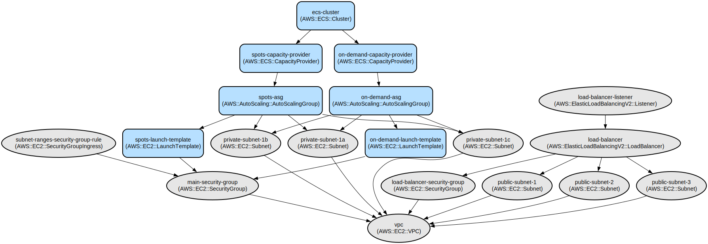

# AWS ECS Cluster Infrastructure with Mixed Instance Types and Auto Scaling

This project provides a complete Infrastructure as Code (IaC) solution for deploying a highly available Amazon ECS cluster with mixed instance types (On-Demand and Spot) using Terraform. It implements a production-ready infrastructure with auto-scaling capabilities, load balancing, and secure networking configurations.

The infrastructure supports both cost-optimized workloads using Spot instances and reliable workloads using On-Demand instances. It features automatic scaling based on demand, with configurable capacity providers including Fargate and EC2, making it suitable for running containerized applications at scale. The setup includes a public-facing Application Load Balancer (ALB) with support for both HTTP and HTTPS traffic, and implements security best practices through carefully configured security groups and network isolation.

## Repository Structure
```
.
├── asg_spots.tf              # Auto Scaling Group configuration for Spot instances
├── asg.tf                    # Auto Scaling Group configuration for On-Demand instances
├── backend.tf                # Terraform state management configuration
├── data.tf                   # AWS resource data source definitions
├── ecs.tf                    # ECS cluster and capacity provider configurations
├── launch_template_spots.tf  # Launch template for Spot instances
├── launch_template.tf        # Launch template for On-Demand instances
├── load_balancer.tf         # Application Load Balancer configuration
├── output.tf                # Output definitions for resource references
├── parameters.tf            # SSM Parameter Store configurations
├── providers.tf             # AWS provider configuration
├── sg.tf                    # Security group definitions
└── variables.tf             # Input variable definitions
```

## Usage Instructions
### Prerequisites
- AWS Account with appropriate permissions
- Terraform >= 0.12
- AWS CLI configured with appropriate credentials
- Access to create and manage:
  - ECS Clusters
  - Auto Scaling Groups
  - Launch Templates
  - Load Balancers
  - Security Groups
  - SSM Parameters

### Installation

1. Clone the repository:
```bash
git clone <repository-url>
cd <repository-directory>
```

2. Initialize Terraform:
```bash
terraform init
```

3. Configure your variables:
Create a `terraform.tfvars` file with the following required variables:
```hcl
project_name = "your-project-name"
region = "your-aws-region"
nodes_ami = "ami-xxxxx"
node_instance_type = "t3.medium"
cluster_on_demand_desired_size = 2
cluster_on_demand_max_size = 4
cluster_on_demand_min_size = 1
cluster_spot_desired_size = 1
cluster_spot_max_size = 2
cluster_spot_min_size = 0
```

### Quick Start

1. Review the infrastructure plan:
```bash
terraform plan
```

2. Apply the infrastructure:

For Dev: 
```bash
terraform apply --auto-approve -var-file=environment/dev/terraform.tfvars
```
For Prod:
```bash
terraform apply --auto-approve -var-file=environment/prod/terraform.tfvars

3. Verify the deployment:
```bash
aws ecs list-clusters --region <your-region>
```

### More Detailed Examples

1. Configuring capacity providers:
```hcl
capacity_providers = ["FARGATE", "FARGATE_SPOT"]
```

2. Adjusting Auto Scaling settings:
```hcl
cluster_on_demand_desired_size = 3
cluster_on_demand_max_size = 6
cluster_on_demand_min_size = 2
```

### Troubleshooting

Common Issues:

1. Launch Template Creation Fails
```
Error: Error creating launch template
```
Solution:
- Verify IAM permissions
- Check AMI ID exists in the specified region
- Validate security group configurations

2. Auto Scaling Group Issues
```
Error: Error creating AutoScaling Group
```
Solution:
- Verify subnet IDs exist
- Check VPC configurations
- Validate capacity provider settings

Debug Mode:
Enable detailed AWS API logging:
```bash
export TF_LOG=DEBUG
export TF_LOG_PATH=terraform.log
```

## Data Flow
The infrastructure implements a multi-tier architecture with public and private subnets, where container workloads run in private subnets with outbound internet access through NAT Gateways.

```ascii
                                     ┌──────────────┐
                                     │     ALB      │
                                     └──────┬───────┘
                                           │
                                           ▼
                        ┌─────────────────────────────────┐
                        │         Security Group          │
                        └─────────────┬───────────────────┘
                                     │
                     ┌───────────────┴───────────────┐
                     ▼                               ▼
              ┌──────────────┐               ┌──────────────┐
              │  On-Demand   │               │     Spot     │
              │     ASG      │               │     ASG      │
              └──────────────┘               └──────────────┘
                     │                               │
                     └───────────────┬───────────────┘
                                    ▼
                           ┌──────────────┐
                           │ ECS Cluster  │
                           └──────────────┘
```

Key Component Interactions:
1. ALB routes incoming traffic to ECS services
2. Security groups control access between components
3. Auto Scaling Groups manage EC2 instance lifecycle
4. ECS Capacity Providers optimize instance distribution
5. Launch Templates define instance configurations
6. SSM Parameters store infrastructure references

## Infrastructure



### Load Balancer
- Application Load Balancer (ALB)
  - Public facing
  - HTTP/HTTPS listeners
  - Security group with port 80/443 ingress

### Compute
- ECS Cluster
  - Mixed instance types (On-Demand and Spot)
  - Auto Scaling Groups
  - Launch Templates with ECS optimization
  - Capacity Providers with target tracking

### Networking
- Security Groups
  - VPC traffic allowed (10.0.0.0/16)
  - All outbound traffic allowed
  - Controlled inbound access

### Auto Scaling
- On-Demand ASG
  - Configurable desired/min/max capacity
  - ECS capacity provider integration
- Spot ASG
  - Cost-optimized instance allocation
  - Managed scaling with 90% target utilization